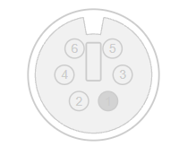
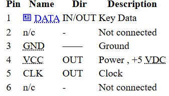
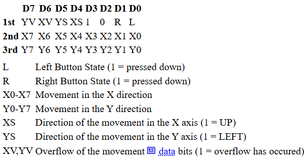
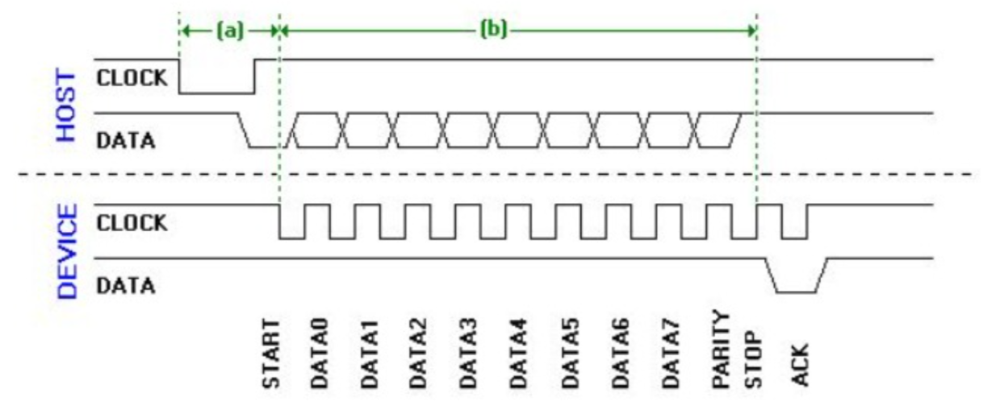

# ps2_mouse
Repositorio grupo de ps2_mouse

## Conexiones fisicas del dispositivo

El ps/2 del mouse consta de un conector de 5 o 6 pines (dependiendo del dispositivo), los cuales asignan 4 pines em ambos casos, y es posible usar un adaptador de uno a otro, o lograr usar algún pin para otro proposito.






## Lista de paquetes de datos e informacion que envia el raton

Cuando el ratón PS2 envía información, debe enviar tres paquetes de datos consecutivos. Cada paquete contiene información diferente sobre el botón pulsado, el movimiento y la dirección del mismo. La tabla siguiente muestra la información que se envía en cada paquete.

Hay que tener en cuenta que esta información es general y puede variar según el fabricante. Esto se aplica a un ratón de dos botones; la asignación de bits para otros tipos de ratones (de tres botones o con rueda de desplazamiento) es diferente.



## Forma de onda



#  Interfaz de Mouse PS/2

##  Descripción

Este proyecto implementa la comunicación entre un mouse y un sistema anfitrión utilizando el protocolo **PS/2**.

El objetivo es utilizar un mouse PS/2 como periférico de entrada para una consola de videojuegos, interpretando los datos enviados por el mouse para obtener información sobre el movimiento y el estado de sus botones.

La comunicación PS/2 utiliza dos señales principales:

- **Clock:** señal de reloj.
- **Data:** transmisión de datos.

---

##  Funcionamiento

El mouse PS/2 utiliza una comunicación serial síncrona entre el dispositivo y el sistema anfitrión.

El mouse proporciona información sobre:

- Movimiento horizontal (X).
- Movimiento vertical (Y).
- Botón izquierdo.
- Botón derecho.
- Botón central.

Al encenderse, el mouse realiza un proceso de autodiagnóstico denominado **BAT (Basic Assurance Test)**.

Si el diagnóstico es exitoso, el mouse envía:

```text
0xAA
```

Posteriormente envía su identificador:

```text
0x00
```

El identificador `0x00` corresponde al mouse PS/2 estándar.

---

##  Paquete de datos

Un mouse PS/2 estándar transmite la información de movimiento mediante paquetes de **3 bytes**.

### Byte 1

```text
Bit 7    Y Overflow
Bit 6    X Overflow
Bit 5    Y Sign
Bit 4    X Sign
Bit 3    Siempre 1
Bit 2    Botón central
Bit 1    Botón derecho
Bit 0    Botón izquierdo
```

### Byte 2

```text
Movimiento en X
```

### Byte 3

```text
Movimiento en Y
```

Por lo tanto, un paquete completo tiene la siguiente estructura:

```text
+--------+--------+--------+
| Byte 1 | Byte 2 | Byte 3 |
+--------+--------+--------+
| Estado |   X    |   Y    |
+--------+--------+--------+
```

---

##  Interpretación de los datos

El primer byte permite determinar el estado de los botones y el signo del movimiento.

```text
Byte 1

Bit 0 → Botón izquierdo
Bit 1 → Botón derecho
Bit 2 → Botón central
Bit 3 → Bit de sincronización
Bit 4 → Signo de X
Bit 5 → Signo de Y
Bit 6 → Overflow de X
Bit 7 → Overflow de Y
```

Los movimientos X e Y se representan mediante valores de **9 bits en complemento a dos**.

El rango de movimiento representable es:

```text
-255 a +255
```

---

##  Modos de operación

El protocolo PS/2 contempla diferentes modos de funcionamiento:

### Reset Mode

Se utiliza durante el encendido del mouse o cuando recibe el comando:

```text
0xFF
```

El mouse realiza el diagnóstico BAT y restablece sus parámetros.

### Stream Mode

Es el modo utilizado normalmente.

El mouse transmite información cuando detecta:

- Movimiento.
- Cambio en el estado de un botón.

### Remote Mode

El mouse no transmite automáticamente los datos.

El sistema anfitrión solicita la información mediante:

```text
0xEB
```

### Wrap Mode

Es un modo utilizado principalmente para comprobar la comunicación entre el mouse y el sistema anfitrión.

---

##  Comandos principales

| Comando | Función |
|--------:|---------|
| `0xFF` | Reset |
| `0xFE` | Resend |
| `0xF6` | Restaurar valores predeterminados |
| `0xF5` | Deshabilitar transmisión de datos |
| `0xF4` | Habilitar transmisión de datos |
| `0xF3` | Configurar frecuencia de muestreo |
| `0xF2` | Obtener ID del dispositivo |
| `0xF0` | Activar Remote Mode |
| `0xEE` | Activar Wrap Mode |
| `0xEC` | Salir de Wrap Mode |
| `0xEB` | Solicitar datos en Remote Mode |
| `0xE8` | Configurar resolución |
| `0xE7` | Escalamiento 2:1 |
| `0xE6` | Escalamiento 1:1 |

---

## Comunicación

La comunicación utiliza dos líneas:

```text
Mouse                  Sistema
  │                      │
  ├────── CLOCK ────────►
  │                      │
  ├────── DATA ─────────►
  │                      │
  └──────────────────────┘
```

El protocolo permite comunicación bidireccional, por lo que el sistema anfitrión también puede enviar comandos al mouse.

---

##  Aplicación en el proyecto

En este proyecto, el sistema debe:

1. Inicializar la interfaz PS/2.
2. Esperar la respuesta de inicialización del mouse.
3. Detectar el paquete de datos.
4. Recibir los tres bytes del paquete.
5. Verificar los bits de control.
6. Extraer los valores de X y Y.
7. Detectar el estado de los botones.
8. Utilizar estos datos como entradas para la consola.

El flujo básico del sistema es:

```text
       INICIO
          │
          ▼
   Inicializar PS/2
          │
          ▼
   Inicializar Mouse
          │
          ▼
    Recibir paquete
          │
          ▼
   ¿Paquete válido?
      │          │
     NO         SÍ
      │          │
      │          ▼
      │     Leer X e Y
      │          │
      │          ▼
      │    Leer botones
      │          │
      │          ▼
      │    Enviar datos
      │          │
      └──────────┘
```

---

##  Tecnologías

- Protocolo **PS/2**
- Mouse PS/2
- Comunicación serial síncrona
- Sistema embebido / FPGA / microcontrolador
- Lenguaje de descripción de hardware o lenguaje utilizado por el controlador

---

##  Referencias

- Adam Chapweske, **PS/2 Mouse Interfacing**  
  https://isdaman.com/alsos/hardware/mouse/ps2interface.htm

- PS/2 Mouse Protocol  
  https://wiki.osdev.org/PS/2_Mouse

---

